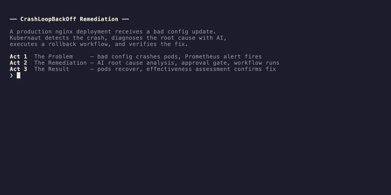

# Scenario #120: CrashLoopBackOff Remediation

## Demo



## Overview

Demonstrates Kubernaut detecting a CrashLoopBackOff caused by a bad configuration
change and performing an automatic rollback to the previous working revision.

| | |
|---|---|
| **Signal** | `KubePodCrashLooping` -- restart count increasing rapidly |
| **Root cause** | Invalid demo-http-server configuration deployed via ConfigMap swap |
| **Remediation** | `kubectl rollout undo` restores the previous healthy revision |
| **Approval** | **Required** — production environment (`run.sh` enforces deterministic approval) |

## Signal Flow

```
kube_pod_container_status_restarts_total increasing → KubePodCrashLooping alert
  → Gateway → SP → AA (KA + real LLM)
  → LLM diagnoses bad config causing CrashLoopBackOff
  → Selects GracefulRestart (rollback) workflow
  → RO → WE (kubectl rollout undo)
  → EM verifies pods running, restarts stabilized
```

## Prerequisites

| Component | Requirement |
|-----------|-------------|
| Cluster | Kind or OCP with Kubernaut services |
| LLM backend | Real LLM (not mock) via Kubernaut Agent |
| Prometheus | With kube-state-metrics |
| Workflow catalog | `crashloop-rollback-v1` registered in DataStorage |

### Workflow RBAC

This scenario's remediation workflow runs under a dedicated ServiceAccount with
scoped permissions (created automatically when workflows are seeded via
`platform-helper.sh`):

| Resource | Name |
|----------|------|
| ServiceAccount | `crashloop-rollback-v1-runner` (in `kubernaut-workflows`) |
| ClusterRole | `crashloop-rollback-v1-runner` |
| ClusterRoleBinding | `crashloop-rollback-v1-runner` |

**Permissions**:

| API group | Resource | Verbs |
|-----------|----------|-------|
| `apps` | deployments | get, list, patch, update |
| `apps` | replicasets | get, list |
| core | pods | get, list |

## Running the Scenario

> [!TIP]
> **OCP users**: This walkthrough defaults to Kind. Look for the **OCP** dropdowns
> on steps that differ. For automated runs, prefix with `export PLATFORM=ocp`.
>
> **Time estimate**: ~10 min (Kind) · ~15 min (OCP)

### Automated Run

```bash
./scenarios/crashloop/run.sh
```

<details>
<summary><strong>OCP</strong></summary>

```bash
export PLATFORM=ocp
./scenarios/crashloop/run.sh
```

</details>

### Manual Step-by-Step

#### 1. Deploy the healthy workload

```bash
kubectl apply -k scenarios/crashloop/manifests/
kubectl wait --for=condition=Available deployment/worker -n demo-crashloop --timeout=120s
```

<details>
<summary><strong>OCP</strong></summary>

```bash
kubectl apply -k scenarios/crashloop/overlays/ocp/
kubectl wait --for=condition=Available deployment/worker -n demo-crashloop --timeout=120s
```

</details>

#### 2. Verify healthy state

```bash
kubectl get pods -n demo-crashloop
# All pods should be Running with 0 restarts
```

<details>
<summary>Expected output</summary>

```
NAME                      READY   STATUS    RESTARTS   AGE
worker-6b8c9f4d5-x2k7p   1/1     Running   0          45s
```

</details>

#### 3. Inject bad configuration

```bash
bash scenarios/crashloop/inject-bad-config.sh
```

The script creates a `worker-config-bad` ConfigMap with an `invalid_directive` that causes demo-http-server to exit
and patches the deployment to reference it. Pods will crash on startup.

#### 4. Observe CrashLoopBackOff

```bash
kubectl get pods -n demo-crashloop -w
# Pods cycle: Error -> CrashLoopBackOff -> Error -> ...
```

<details>
<summary>Expected output</summary>

```
NAME                      READY   STATUS             RESTARTS      AGE
worker-7f4a8b3c1-q9m2p   0/1     CrashLoopBackOff   3 (30s ago)   2m
```

</details>

#### 5. Wait for alert and pipeline

The alert fires after >3 restarts in 10 min (~2-3 min).

> [!NOTE]
> **OCP timing**: Alerts may take 3-5 minutes to fire on OCP (vs ~2 min on Kind)
> due to the default 30s kube-state-metrics scrape interval and Alertmanager
> group_wait settings.

Query Alertmanager for active alerts:

```bash
kubectl exec -n monitoring alertmanager-kube-prometheus-stack-alertmanager-0 -c alertmanager -- \
  amtool alert query alertname=KubePodCrashLooping --alertmanager.url=http://localhost:9093
```

<details>
<summary><strong>OCP</strong></summary>

```bash
kubectl exec -n openshift-monitoring alertmanager-main-0 -- \
  amtool alert query alertname=KubePodCrashLooping --alertmanager.url=http://localhost:9093
```

</details>

Watch Kubernaut pipeline progression:

```bash
watch kubectl get rr,sp,aia,wfe,ea,notif -n kubernaut-system
```

#### 6. Inspect AI Analysis

```bash
# Get the latest AIA resource
AIA=$(kubectl get aia -n kubernaut-system -o name --sort-by=.metadata.creationTimestamp | tail -1)

# Root cause analysis: summary, severity, and remediation target
kubectl get $AIA -n kubernaut-system -o jsonpath='
Root Cause:  {.status.rootCauseAnalysis.summary}
Severity:    {.status.rootCauseAnalysis.severity}
Target:      {.status.rootCauseAnalysis.remediationTarget.kind}/{.status.rootCauseAnalysis.remediationTarget.name}
'; echo

# Selected workflow and LLM rationale
kubectl get $AIA -n kubernaut-system -o jsonpath='
Workflow:    {.status.selectedWorkflow.workflowId}
Confidence:  {.status.selectedWorkflow.confidence}
Rationale:   {.status.selectedWorkflow.rationale}
'; echo

# Alternative workflows considered
kubectl get $AIA -n kubernaut-system -o jsonpath='{range .status.alternativeWorkflows[*]}  Alt: {.workflowId} (confidence: {.confidence}) -- {.rationale}{"\n"}{end}'

# Approval context and investigation narrative
kubectl get $AIA -n kubernaut-system -o jsonpath='
Approval:    {.status.approvalRequired}
Reason:      {.status.approvalContext.reason}
Confidence:  {.status.approvalContext.confidenceLevel}
'; echo
kubectl get $AIA -n kubernaut-system -o jsonpath='{.status.approvalContext.investigationSummary}'; echo
```

#### Expected LLM Reasoning (v1.2 baseline)

When Kubernaut's AI analysis processes this scenario, the LLM typically reasons as follows:

| Field | Expected Value |
|-------|---------------|
| **Root Cause** | Pod worker-77784c6cf7-fwmgv is in CrashLoopBackOff due to invalid configuration directive in ConfigMap worker-config-bad. The application fails startup validation and exits with code 1. Deployment is stuck in rolling update with 1 crashing pod from new ReplicaSet while 2 healthy pods from previous ReplicaSet maintain service availability. |
| **Severity** | critical |
| **Target Resource** | Deployment/worker (ns: demo-crashloop) |
| **Workflow Selected** | crashloop-rollback-v1 |
| **Confidence** | 0.90 |
| **Approval** | required (production environment) |

**Key Reasoning Chain:**

1. Detects CrashLoopBackOff with exit code 1 indicating config error.
2. Traces crash to recently updated ConfigMap containing invalid directive.
3. Identifies rollback as appropriate since previous revision was healthy.

> **Why this matters**: Demonstrates the LLM's ability to trace a pod crash to a ConfigMap root cause (signal resource != RCA resource) and select rollback over restart.

#### 7. Verify remediation

```bash
kubectl get pods -n demo-crashloop
# All pods Running/Ready with no recent restarts
kubectl rollout history deployment/worker -n demo-crashloop
```

<details>
<summary>Expected output</summary>

```
NAME                      READY   STATUS    RESTARTS   AGE
worker-6b8c9f4d5-x2k7p   1/1     Running   0          60s
```

</details>

<details>
<summary>Troubleshooting</summary>

| Symptom | Likely cause | Fix |
|---------|-------------|-----|
| Alert doesn't fire after 5 min | Prometheus not scraping kube-state-metrics | `kubectl get servicemonitor -A` and check targets in Prometheus UI |
| Pipeline stalls at SP | Gateway didn't forward the alert | Check Gateway logs: `kubectl logs -n kubernaut-system deploy/kubernaut-gateway` |
| WFE stays `Pending` | ServiceAccount missing or RBAC misconfigured | Verify SA exists: `kubectl get sa crashloop-rollback-v1-runner -n kubernaut-workflows` |
| Rollback didn't happen | WFE job failed | Check job logs: `kubectl logs -n kubernaut-workflows -l kubernaut.ai/workflow-execution --tail=50` |

</details>

#### 8. View notifications

```bash
kubectl get notif -n kubernaut-system --sort-by=.metadata.creationTimestamp
NOTIF=$(kubectl get notif -n kubernaut-system -o name --sort-by=.metadata.creationTimestamp | tail -1)
kubectl get $NOTIF -n kubernaut-system -o jsonpath='{.spec.body}'; echo
```

## Cleanup

```bash
./scenarios/crashloop/cleanup.sh
```

## BDD Specification

```gherkin
Given a Kind cluster with Kubernaut services and a real LLM backend
  And Prometheus is scraping kube-state-metrics
  And the "crashloop-rollback-v1" workflow is registered in the DataStorage catalog
  And the "worker" deployment is running healthily in namespace "demo-crashloop"

When a bad ConfigMap is deployed that causes demo-http-server to fail on startup
  And the deployment is patched to reference the bad ConfigMap
  And pods enter CrashLoopBackOff with rapidly increasing restart counts
  And the KubePodCrashLooping alert fires (>3 restarts in 10 min)

Then Kubernaut Gateway receives the alert via Alertmanager webhook
  And Signal Processing enriches the signal with business labels
  And AI Analysis (KA + LLM) diagnoses CrashLoopBackOff from bad configuration
  And the LLM selects the "GracefulRestart" workflow (crashloop-rollback-v1)
  And Remediation Orchestrator creates a WorkflowExecution
  And Workflow Execution rolls back the deployment to the previous revision
  And the pods start successfully with the restored healthy configuration
  And Effectiveness Monitor confirms the deployment is healthy and restarts stabilized
```

## Acceptance Criteria

- [ ] Worker deployment starts healthy and serves traffic
- [ ] Bad config injection causes immediate CrashLoopBackOff
- [ ] Alert fires within 2-3 minutes of first crash
- [ ] LLM correctly diagnoses bad config as root cause
- [ ] Rollback restores the original healthy ConfigMap reference
- [ ] All pods become Running/Ready after rollback
- [ ] Restart count stabilizes (no further restarts)
- [ ] EM confirms successful remediation
